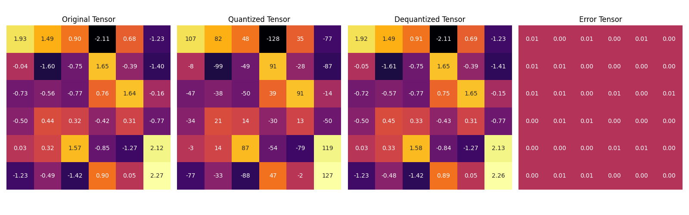
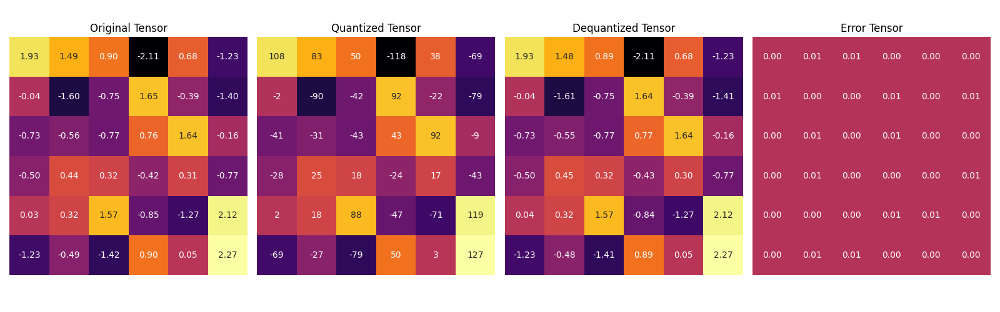
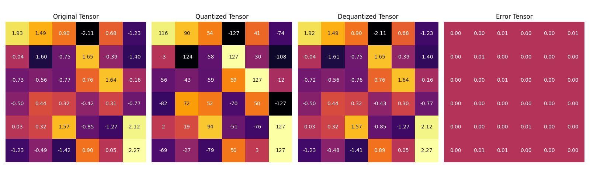

# Quantization: Compressing Models

This repository provides a collection of Python scripts and code snippets designed to experiment with custom quantization techniques, focusing on optimizing model precision and memory usage without sacrificing performance.

## What is Quantization?

Quantization is the process of mapping a large set of input values to a smaller set, often using integers. In digital signal processing, it reduces data precision to make storage and computation more efficient while retaining essential information. With the rise of Large Language Models (LLMs), quantization has become a key technique to compress models and speed up inference, aiming to reduce their size with minimal impact on performance.

By using low-precision data types like 8-bit integers (int8) instead of 32-bit floating points (float32), quantization reduces computational and memory costs. This allows faster operations, lower energy consumption, and enables models to run on devices that support only integer data types, such as embedded systems.

## Tensor Types

### Integer Types

- `int4`: A 4-bit signed integer (values from -8 to 7), used in advanced deep learning quantization to minimize model size and memory usage. It significantly reduces memory usage and accelerates inference, making it ideal for resource-constrained devices and SOTA LLMs, though it comes with a precision loss. Also, quantized 4-bit integer values are stored as a 8-bit integer since there is no support.

- `int8`: An 8-bit signed integer (values from -128 to 127), commonly used for quantized models in deep learning. It offers a good balance between memory efficiency and accuracy, accelerating inference without significant loss in performance, especially in vision and language models.


`int16` is a 16-bit signed integer with a range from $-2^{15}$ to $2^{15}-1$, used for moderate precision with lower memory requirements. `int32` is a 32-bit signed integer ranging from $-2^{31}$ to $2^{31}-1$, and it’s commonly used in general computing tasks. `int64` is a 64-bit signed integer with a range from $-2^{63}$ to $2^{63}-1$ suited for handling very large numbers and high-precision needs.

In deep learning quantization, `int16`, `int32`, and `int64` are not commonly used. The focus is on `int8` for efficient compression and `int4` for extreme compression.


### Floating-Point Types

- `float16` (Half Precision): A 16-bit floating-point format, also known as binary16. It consists of 1 sign bit, 5 exponent bits, and 10 fraction bits. `float16` provides a balance between precision and memory efficiency, making it useful in deep learning for certain operations and model compression techniques.

- `bfloat16` (Brain Floating Point): A 16-bit floating-point format developed by Google Brain. It has 1 sign bit, 8 exponent bits, and 7 fraction bits. `bfloat16` maintains the same dynamic range as `float32` but with reduced precision, making it particularly useful for training deep neural networks.

- `float32` (Single Precision): A 32-bit floating-point format, also known as binary32. It consists of 1 sign bit, 8 exponent bits, and 23 fraction bits. It is the standard precision for most deep learning models, balancing computational accuracy and resource requirements. 

.jpg?format=webp)

### Downcasting Error in Dot Product

- Dot product using `float32`: Higher precision result.
- Dot product using `bfloat16`: Lower precision, resulting in a small error compared to `float32`.

## Model Precision

Custom `SimpleCNN` and a pre-trained MobileViT model from Hugging Face were used to demonstrate the differences in memory usage, performance, and numerical precision. The models were tested for memory efficiency, numerical accuracy, and classification performance on an image classification task.

### Logits and Precision Comparison

The logits (outputs) of the models were calculated with inputs of various precisions. For `FP32` and `BF16`, the results were similar, but `FP16` raised an error on the CPU during convolutions, as it's not supported for certain operations without GPU support. 

**Differences**:
- The difference between `FP32` and `BF16` logits was minimal:
  - **Mean difference**: ~0.00022
  - **Max difference**: ~0.00061

This indicates that the `BF16` precision was nearly as accurate as `FP32` but with a significant reduction in memory usage.

### Hugging Face MobileViT Model

We also tested MobileViT in `FP32` and `BF16` formats:
- **FP32 Memory Footprint**: ~22.36 MB
- **BF16 Memory Footprint**: ~11.18 MB

The classification results on the same image were nearly identical, with the predicted class being "tabby cat" in both cases:
- **FP32 Probability**: ~0.2997
- **BF16 Probability**: ~0.2793

This shows that `BF16` offers a significant reduction in memory without a large tradeoff in accuracy.

## Linear Quantization & Implementation

Linear Quantization is a technique used in deep learning to reduce the precision of the model's weights and activations, effectively compressing the model size and speeding up inference, especially on hardware with limited resources and very big models. The idea is to map high-precision floating-point numbers (e.g., 32-bit) to lower-precision numbers (e.g., 8-bit integers) while maintaining reasonable accuracy.


Consider a weight value from the original floating-point space, which lies in the range $[r_{min}, r_{max}]$.

We want to quantize this into k-bit integer values, say $q \in{\{-2^{k-1}, -1, 0, 1, ..., 2^{k-1} - 1\}}$

The quantization process consists of three steps:
- Calculate the scale:
  $$\text{scale} = \frac{r_\text{max} - r_\text{min}}{q_\text{max} - q_\text{min}}$$

- Calculate the zero point:
  $$\text{zero\_point} = \text{round}\left(q_\text{min} - \frac{r_\text{min}}{\text{scale}}\right)$$
  
  The scale determines how to scale floating-point numbers into integer values, while the zero-point shifts the floating-point values so that the integer representation is correctly aligned.

- The floating-point value is mapped to an integer:
  $$q_x = \left\lfloor \text{round}(\frac{r_x}{\text{scale}} + \text{zero\_point})\right\rceil$$
  where $\left\lfloor \cdot \right\rceil$ denotes rounding to the nearest integer.

Dequantization: During inference, the quantized values can be converted back to approximate floating-point values:
$$x_{\text{dequantized}} = \text{scale} \ \times \ (q_x - \text{zero\_point})$$

What has been explained so far is related to the `asymmetric` mode of linear quantization. In `asymmetric` mode, the exact minimum and maximum values of the float range are mapped. In the other mode, `symmetric` mode, the `maximum absolute value` is chosen and zero point is not used or taken as zero.


Symmetric Quantization Steps:

- Calculate the scale:
  $$\text{scale} = \frac{\text{max}(|r|)}{q_{max}}$$

- Zero point: $$\text{zero\_point} = 0$$
- Mapping floating-point value to integer:
  $$q_x = \left\lfloor \text{round}(\frac{r_x}{\text{scale}})\right\rceil$$

Dequantization:
$$x_{\text{dequantized}} = \text{scale} \times q_x $$

### Quantization Granularity

Quantization granularity refers to the level of detail at which the quantization process is applied. It essentially defines how finely we "slice" the original high-precision values into lower-precision ones.

- `Per-tensor quantization`: In this method, the entire tensor (e.g., weights or activations) is quantized using a single scale and zero point. This approach is simple and effective for models where the range of values is similar across the tensor. However, it may not capture variations well, leading to potential accuracy loss.

- `Channel-wise quantization`: Here, each channel in a layer has its own scale and zero point. This allows for more flexibility and better representation of the variations in values across different channels.

- `Group-wise (Block-Wise) quantization`: Group-wise quantization partitions the model weights into groups, applying separate quantization parameters for each group. The grouping strategy can impact performance, with smaller groups offering finer control but potentially higher overhead.


### Comparison of Different Approaches in Linear Quantization

**Asymmetric & Per-Tensor Quantization**:

Mean Absolute Quantization Error: 0.004376380238682032 \
Mean Squared Quantization Error: 2.4948101781774312e-05 \
Mean Relative Quantization Error: 0.013124296441674232



**Symmetric & Per-Tensor Quantization**:

Mean Absolute Quantization Error: 0.003586699953302741 \
Mean Squared Quantization Error: 1.9748662452911958e-05 \
Mean Relative Quantization Error: 0.011720110662281513



**Symmetric & Channel-wise Quantization**:

Mean Absolute Quantization Error: 0.0029604281298816204 \
Mean Squared Quantization Error: 1.3966978258395102e-05 \
Mean Relative Quantization Error: 0.009984401986002922



**Symmetric & Group-wise Quantization**:


Mean Absolute Quantization Error: 0.0020830007269978523 \
Mean Squared Quantization Error: 9.32090279093245e-06 \
Mean Relative Quantization Error: 0.010240617208182812

## Quantization with Optimum.quanto

Linear quantization was performed on the `google/flan-t5-small` model using the `optimum.quanto` package with 8bit integers. The model size was reduced from `307.84 MB` to `126.83 MB`. No change was observed in the model output. In addition, the inference speed increased by a factor of 26.

```
The model size is 307.84 MBs
Inference time for the original model: 20.369 seconds
<pad> Turkey is located in the southern part of the country.</s>

The quantized model size is 126.83 MBs
<pad> Turkey is located in the southern part of the country.</s>
Inference time for the quantized model: 0.770 seconds
```

## Custom Linear Layer Quantizer

It provides a way to reduce the model memory footprint and speed up inference by applying a special linear layer quantisation that replaces the `nn.Linear` layers with `QuantizedLinearLayer`.

### QuantizedLinearLayer Class:    
- The  `QuantizedLinearLayer` replaces the float weights of a linear layer with quantized `int8` values.
- It introduces two parameters: `quantized_weights` and `scales`.    
- The method `quantize_per_channel()` is applied to quantize the weights channel-wise, which ensures with varying value distributions across channels. 

### Model Transformation:
- The function `replace_linear_with_quantized()` recursively traverses the model, replacing `nn.Linear` layers with the custom `QuantizedLinearLayer` where necessary. 
- An optional exclude parameter is provided to leave certain layers unquantized (e.g., the final output layer in a language model like `lm_head`).

### Results
```
Footprint of the model is: 1.32 GBs.
Inference time for the original model: 10.025 seconds
What have you prepared for breakfast?

The day ahead is no laughing matter, but if you're looking to prepare breakfast properly,

Footprint of the model is: 0.42 GBs.
Inference time for the custom quantized model: 1.360 seconds
What have you prepared for breakfast?
I prepare a light breakfast that contains oats, cereal and almond milk. If I'm a bit
```

The model's memory footprint significantly decreased from 1.32 GB to 0.42 GB, while inference time improved from 10.025 seconds to just 1.360 seconds. The quantised model's answers were also often relevant to the question asked. A disadvantage of this custom linear layer quantizer is that it does not use quantized integers in matrix multiplications since the manual torch quantization operations is limited.

## 4-Bit Integer Quantization with Packing

It is a more aggressive quantization technique using 4-bit integers, which aims to reduce the model size even further compared to traditional 8-bit quantization. Since 4-bit storage is not supported, it is implemented by packing two 4-bit integers into a single byte.

### Packing

The weights of linear layers are packed into a single byte by combining two 4-bit integers. Each weight is first quantized to the range of -8 to 7, which is then transformed into a 4-bit representation.

```python
def pack_weights(self, tensor: torch.Tensor):
    assert tensor.dtype == torch.int8
    tensor = tensor + 8
    high_bits = tensor[:, ::2] << 4
    low_bits = tensor[:, 1::2]
    packed = high_bits | low_bits
    return packed
```

The `pack_weights` method takes an input tensor of int8 values, adjusts them to be non-negative, and then separates them into high and low bits. The high bits are shifted left by 4, and the low bits are combined using a bitwise OR operation, resulting in a packed representation.

Let's consider a quantized simple tensor:
```python
tensor = [[-3, 1, -7, 2]]
```

First, we adjust the values to fit within the range [0-15]:
```python
tensor = [[5, 9, 1, 10]] # [[0000 0101, 0000 1001, 0000 0001, 0000 1010]]
```

Next, we extract high and low bit pairs:
```python
high_bits = (tensor[:, ::2] & 0xF) << 4 # [[0101 0000, 0001 0000]]
low_bits = tensor[:, 1::2] & 0xF        # [[0000 1001, 0000 1010]]
```

Lastly, we pack them into single byte:
```python
packed = high_bits | low_bits           # [[0101 1001, 0001 1010]] == [[89, 26]]
```

### Results


Packed 4-bit integer quantisation effectively reduces model size while maintaining performance most of the time. Inference speed is slowed due to the overhead of packing and unpacking operations.In addition, the inability to perform matrix multiplications over integer numbers, as they are not supported by torch.cuda, may also mislead on inference speed.